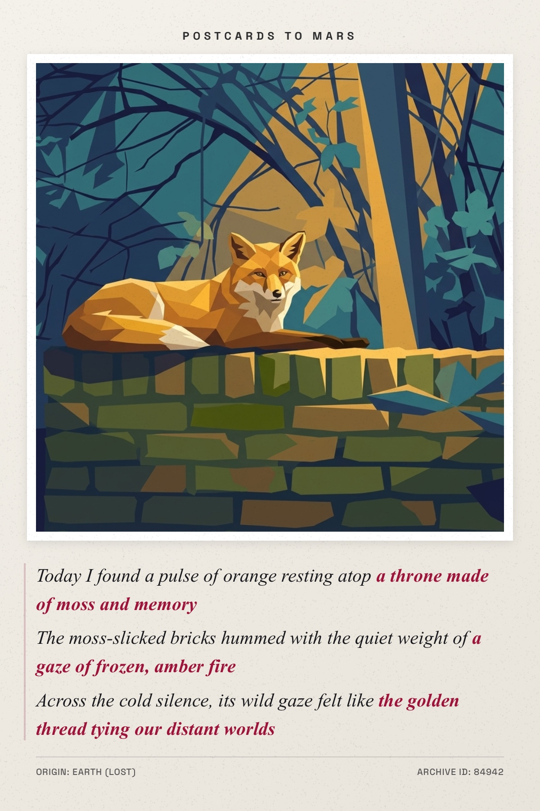
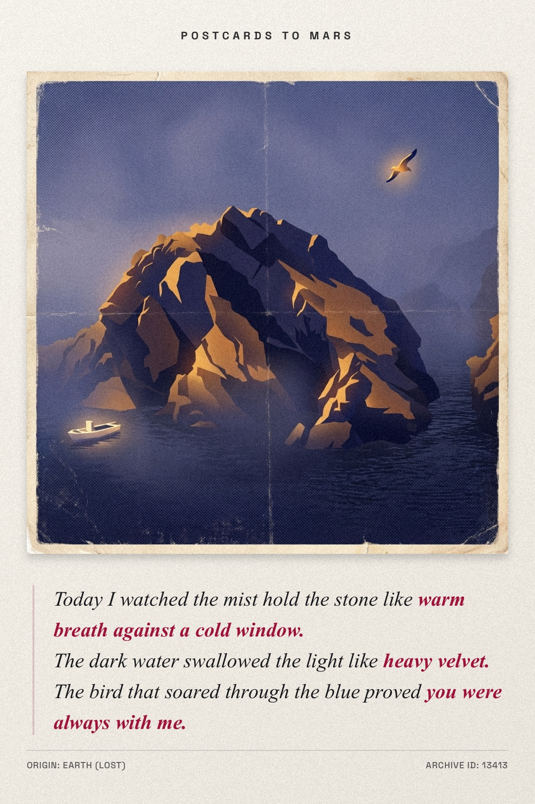

# Postcards to Mars

> "Ideally, a postcard is a bridge. It says 'I am here, you are there, and I am thinking of you.'"

**Postcards to Mars** is a sci-fi themed application that translates visual memories into tangible words. Set in a future where Martian colonies are drifting apart from Earth, this terminal-styled interface allows users to upload an image and receive a poetic "memory artifact" in return.

The system uses AI to analyze your image, generate a three-act poem/dialogue, and create a stylized "postcard" visual, bridging the gap across the cosmos.

## Features

- **Visual Memory Analysis**: Upload an image to be analyzed by the system.
- **Poetry Generation**: Generates a 3-act poem or dialogue based on the visual input.
- **Memory Artifact Creation**: Produces a stylized, low-fidelity "transmission" version of your image.
- **Immersive Sci-Fi Terminal**: A fully themed UI with scanlines, CRT effects, and lore-appropriate interactions.

## Examples

Here are some example transmissions:

    
    

## Run Locally

**Prerequisites:**  Node.js

1. Install dependencies:
   `npm install`
2. Set the `GEMINI_API_KEY` in [.env.local](.env.local) to your Gemini API key
3. Run the app:
   `npm run dev`
